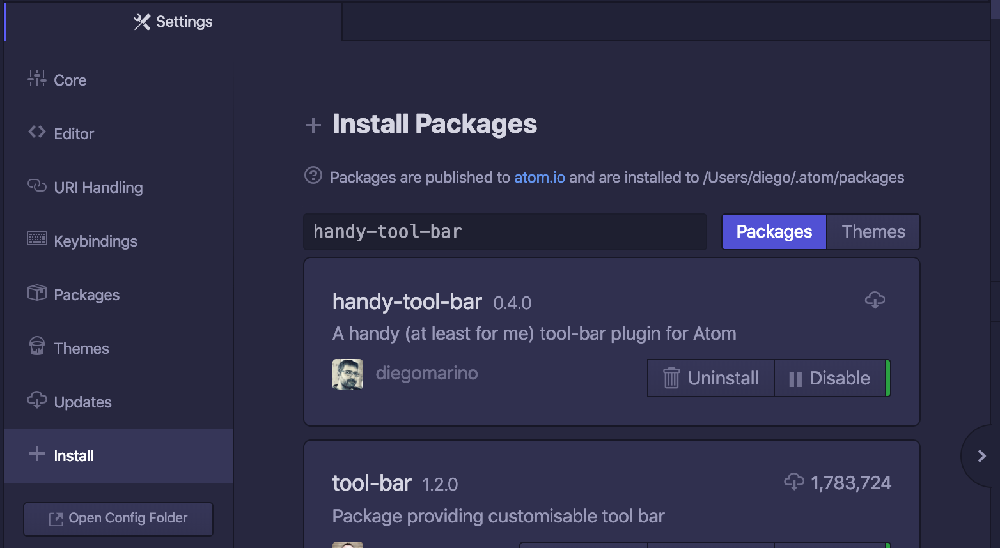

# handy-tool-bar

   

## About

 A handy (at least for me) '[tool-bar](https://atom.io/packages/tool-bar)' plugin for Atom

Forked from the '[tool-bar-basic](https://atom.io/packages/tool-bar-basic) package from @AlexNewson.

## Installation

As easy as typing in your terminal:

`apm install handy-tool-bar`

Also, you can install it from the "Install" section of Atom settings:

In both cases, it will be stored in your `~/.atom/packages` folder

## Buttons

-    Open File
-    Open Folder
-    List Projects (if '[project-manager](https://atom.io/packages/project-manager)' is installed)  
     
-    Split Right
-    Split Down  
     
-    Toggle Fullscreen
-    Toggle Sidebar
-    Toggle Minimap (if '[minimap](https://atom.io/packages/minimap)' is installed)
-    Toggle Exposé (if '[expose](https://atom.io/packages/expose)' is installed)  
     
-    Auto Indent (selection)
-    Unfold all Blocks
-    Beautify Code (if '[atom-beautify](https://atom.io/packages/atom-beautify)' is installed)  
     
-    Toggle Terminal-Plus (if '[terminal-plus](https://atom.io/packages/terminal-plus)' is installed)
-    Reload Window (if in 'Dev mode')
-    Toggle Developer Tools (if in 'Dev mode')  
     
-    Toggle Git-Plus (if '[git-plus](https://atom.io/packages/git-plus)' is installed)  
     
-    Run Script (if '[script](https://atom.io/packages/script)' is installed)
-    Stop Script (if '[script](https://atom.io/packages/script)' is installed)
-    Configure Script (if '[script](https://atom.io/packages/script)' is installed)  
     
-    Markdown Preview (prioritizes using '[markdown-preview-plus](https://atom.io/packages/markdown-preview-plus)' if it's installed)
-    HTML Preview (if '[atom-html-preview](https://atom.io/packages/atom-html-preview)' is installed)
-    HTML Live Server (if '[atom-live-server](https://atom.io/packages/atom-live-server)' is installed)  
     
-    Toggle Command Palette

## Contributing

This started as a personal project, but pull requests are more than welcome :)

1.  Fork it
2.  Create a feature branch with a meaningful name (`git checkout -b my-new-feature`)
3.  Add yourself to the `CONTRIBUTORS.md` file
4.  Commit your changes (`git commit -am 'Add some feature'`)
5.  Push to your branch (`git push origin my-new-feature`)
6.  Create a new pull request

## License

The [MIT License](LICENSE.md)
